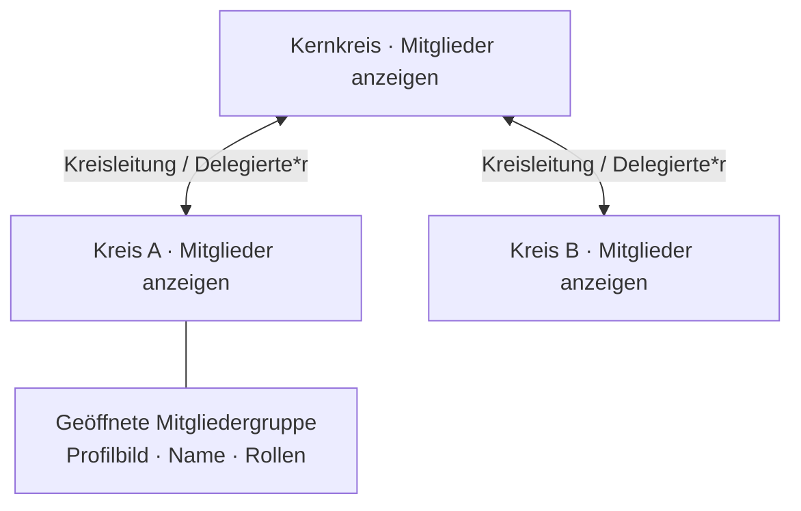

# Vorschlag: Kreisstruktur mit aufklappbaren Mitgliedergruppen

Stand: 2026-09-07. Die JavaScript-Karte setzt diesen Ansatz als ersten
lokalen Prototyp um; die Abnahme im echten HumHub-Layout bleibt offen.

Für dieses Projekt empfehle ich ein **hierarchisches Beziehungsdiagramm mit
aufklappbaren Gruppen**. In der Übersicht zeigt jeder Kreis eine kompakte Karte
mit Name, Mitgliederzahl und zwei deutlich bezeichneten Verbindungsrollen.
Ein Klick öffnet die Mitglieder als übersichtliches Raster mit Bild, Name und
sämtlichen Rollen. Der Kreisname bleibt ein separater Link zum Kreisprofil.

Das lässt die Kreisstruktur auch bei vielen Mitgliedern erkennbar. Personen mit
mehreren Kreismitgliedschaften dürfen in mehreren Gruppen erscheinen: Die
Anzeige beschreibt ihre Zugehörigkeit, nicht mehrere unterschiedliche Personen.
Bei Auswahl einer Person werden ihre weiteren sichtbaren Kreiszugehörigkeiten
hervorgehoben. Alle Mitgliedschaftskanten zugleich würden schnell unlesbar.

## Interaktion

- Anfangs Kernkreis und eigene Kreise öffnen; weitere Gruppen bei Bedarf.
- Ober-/Unterkreis-Verbindungen durchgehend sichtbar und beschriftet.
- Mitgliedergruppen einklappbar; keine Schrift unter Kreisen oder Profilbildern.
- Mandatskurzform bei Hover und Tastaturfokus, zusätzlich im geöffneten Kreis.
- Auswahl einer Person hebt nur deren sichtbare weitere Kreise hervor.
- Tab, Enter und beschriftete Zoom-/Zurücksetzen-Schaltflächen; keine Aktion
  ausschließlich durch Ziehen. Tabellenansicht als weitere Zugriffsmöglichkeit.

## Technische Richtung

Gruppierte Diagramme heißen häufig *Cluster Graphs* beziehungsweise *Compound
Graphs*. [Graphviz](https://graphviz.org/Gallery/directed/cluster.html) zeigt
Gruppen und Verbindungen; [Cytoscape.js](https://js.cytoscape.org/) unterstützt
zusammengesetzte Knoten und Interaktion. Das sind passende technische Ansätze,
keine bereits getroffene Bibliotheksentscheidung. Vor einer Übernahme müssen
Lizenz, Asset-Auslieferung und Layout mit realistischen Beispielen geprüft werden.

Für das Modul zuerst einen unabhängigen Prototyp mit drei Hierarchieebenen,
langen Namen und Personen in mehreren Kreisen bauen. Die Daten liefert weiterhin
nur der serverseitige Sichtbarkeitsfilter. Keine unsichtbaren Kreise oder Personen
für Layout, Suchfunktion oder Hervorhebung an den Browser senden. Das Layout muss
bei gleichen Daten gleich bleiben und ohne externen Netzwerkdienst funktionieren.

Die Karte wird ohne externe JavaScript-Bibliothek ausgeliefert. Sie erzeugt
ihre Kreiskarten ausschließlich aus einer sichtbarkeitsgefilterten
JSON-Repräsentation und setzt alle Texte im Browser über `textContent`.
Dadurch bleiben Zweck, Mandat, Rollen und Mitglieder auch in der dynamischen
Ansicht kontextgerecht behandelt.
